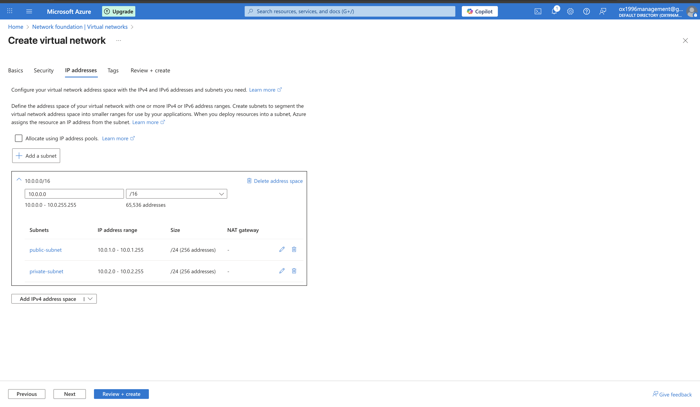

# Peter Delgado  
☁️ Cloud Engineer | Azure • Networking • Virtual Machines

 Focused on building reliable, secure, and scalable infrastructure.  
Hands-on with Azure, cloud networking, virtual machines, and real-world projects.

---
## 🚀 Featured Projects

### ☁️ Azure Public & Private Networking
**Built a secure Azure virtual network architecture with public and private subnets.**  
Configured NSGs, SSH access, and traffic inspection to enforce least-privilege access.

🔗 https://github.com/peterdelgado92013/azure-public-private-networking

---

### 🖥️ Azure Virtual Machine Deployment
**Deployed and secured Windows and Ubuntu virtual machines in Azure.**  
Configured networking, remote access (RDP/SSH), and security best practices.

🔗 https://github.com/peterdelgado92013/azure-virtual-machine-deployment

---

### 🔐 Azure Windows VM – RDP Access
**Configured secure RDP access to a Windows VM in Azure.**  
Focused on access control, firewall rules, and troubleshooting connectivity issues.

🔗 https://github.com/peterdelgado92013/azure-windows-vm-rdp

 ### 🎫 osTicket Help Desk Ticketing System

**Ticket Lifecycle: Intake Through Resolution**

Hands-on implementation of a full help desk ticketing system using **osTicket** hosted on **Microsoft Azure**.  
This project demonstrates real-world IT support workflows from both **admin and end-user perspectives**.

**What I did:**
- Deployed Windows VM in Azure
- Installed & configured IIS
- Installed and configured osTicket
- Created departments, agents, users, and SLAs
- Created, managed, and resolved tickets
- Demonstrated full ticket lifecycle via video

🔗 https://github.com/peterdelgado92013/osTicket-Help-Desk-Ticketing-System-

🎥 **Demo Video:** https://youtu.be/KsUij6ap3wc?si=ZE0KCSe1MTMBi1AM

> Focus: IT support workflows, ticket lifecycle management, and troubleshooting documentation.

---

### ☁️ Microsoft Azure
- Azure Virtual Machine (VM – Virtual Machine) Deployment and Secure Access  
- Configuring On-Premises Active Directory within Azure Virtual Machines  
- Network Security Groups (NSGs – Network Security Groups) and Network Traffic Inspection  

> Focus: Cloud infrastructure, networking, access control, and security best practices.

---

## 🔧 Core Skills & Technologies
- Microsoft Azure (Virtual Machines, Virtual Networks, Network Security Groups)
- Linux (Ubuntu)
- Secure Shell (SSH)
- Active Directory
- Networking Fundamentals (DNS, IP addressing, firewalls)
- Ticketing Systems & IT Service Management (ITSM)

---

## 📈 What I’m Currently Working On
- Expanding Azure cloud projects with a focus on security, monitoring, and cost awareness  
- Building a hands-on cloud engineering portfolio with documented walkthroughs  
- Preparing for Azure cloud certifications  

---

<h2>🤳Connect with me:</h2>

[][linkedin]

[linkedin]: https://linkedin.com/in/peter-delgado-9632a1196/
